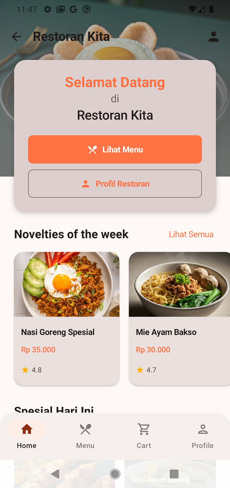
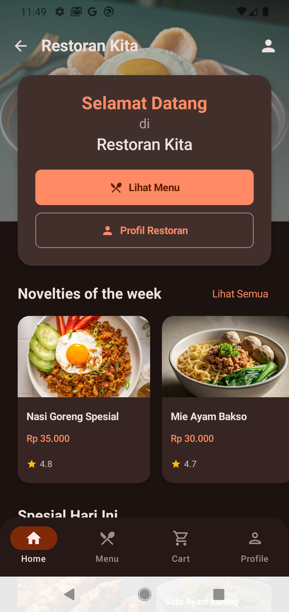
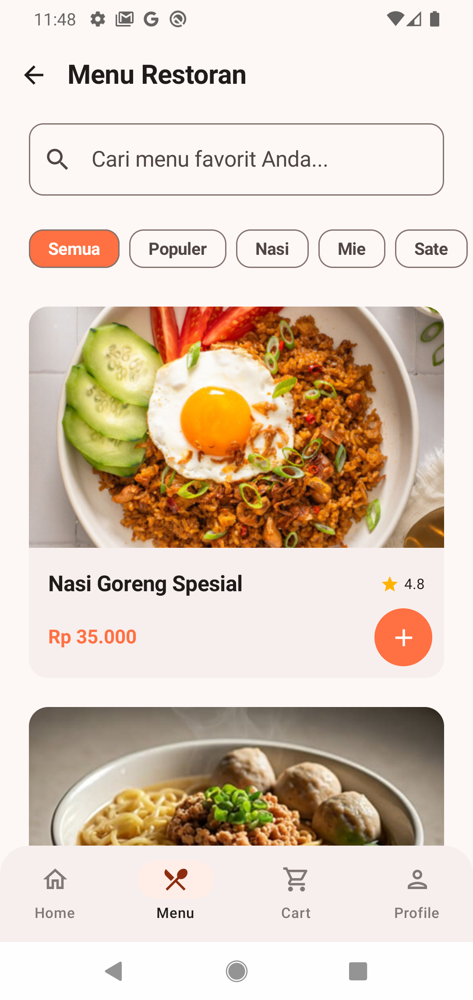
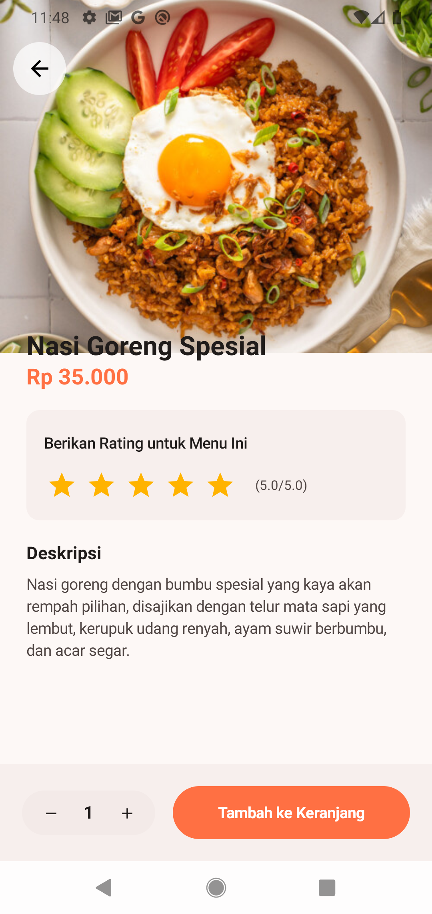
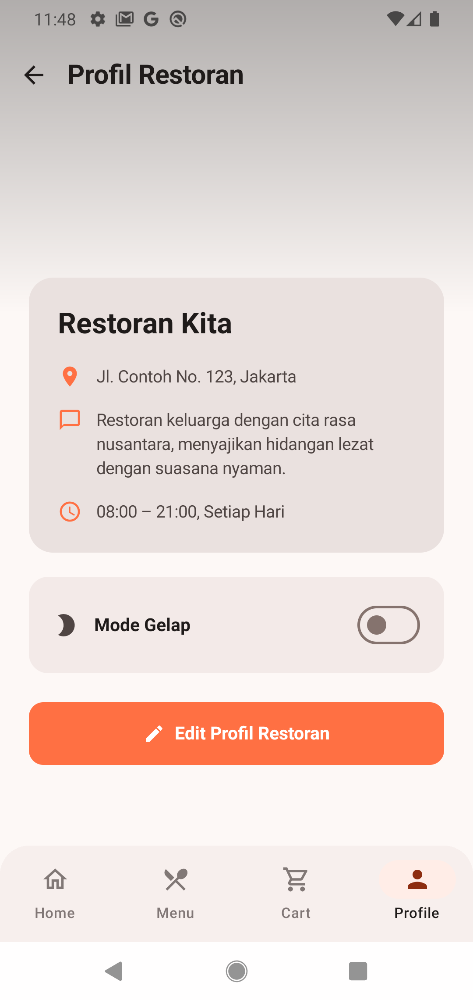
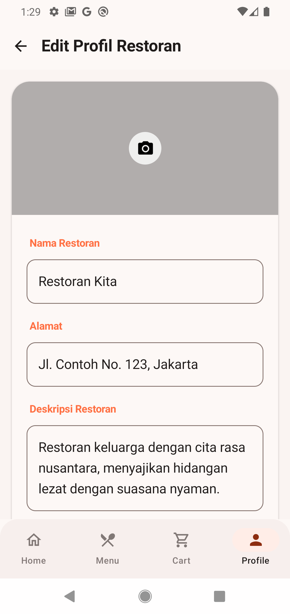
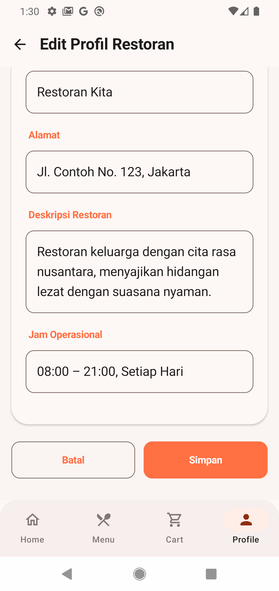

# Tugas UTS Pemrograman Android 2026
**Robertho Wicaksono (23083000106)**

# Restoran Kita - Modern Food Delivery App

Restoran Kita adalah aplikasi katalog makanan modern yang dibangun menggunakan **Jetpack Compose**. Aplikasi ini dirancang untuk memberikan pengalaman memesan makanan yang mulus dengan antarmuka yang bersih dan responsif.

## Fitur Utama

-   **Katalog Menu**: Menampilkan berbagai kategori makanan (Nasi, Mie, Sate, dll) dengan filter pencarian dan kategori.
-   **Detail Menu & Rating**: Informasi lengkap hidangan termasuk deskripsi, harga, dan sistem rating bintang (1-5) yang tersimpan secara lokal.
-   **Keranjang Belanja**: Kelola pesanan Anda, sesuaikan jumlah, dan hitung total biaya pesanan termasuk biaya pengiriman.
-   **Profil Restoran**: Informasi operasional restoran, alamat, dan deskripsi singkat.
-   **Mode Gelap (Dark Mode)**: Dukungan penuh untuk tema gelap guna kenyamanan visual di malam hari.
-   **Persistensi Data**: Menggunakan `SharedPreferences` untuk menyimpan profil restoran, preferensi tema, dan rating menu.

## Screenshot

### Beranda (Light Mode)

*Halaman utama dengan sambutan dan menu unggulan*

### Beranda (Dark Mode)

*Tampilan aplikasi saat Mode Gelap diaktifkan*

### Menu Screen

*Antarmuka Menu Restoran dengan filter kategori*

### Detail Menu

*Detail hidangan dengan deskripsi lengkap dan sistem rating*

### Profil Restoran (Info)

*Informasi restoran dengan toggle Dark Mode*

### Edit Profil (Input)

*Halaman form edit profil restoran*

### Edit Profil (Input)

*Halaman form edit profil restoran*

## Teknologi yang Digunakan

-   **Kotlin**: Bahasa pemrograman utama.
-   **Jetpack Compose**: Toolkit modern untuk membangun UI native Android.
-   **Compose Navigation**: Untuk navigasi antar layar yang efisien.
-   **ViewModel & StateFlow**: Manajemen state aplikasi mengikuti pola arsitektur MVVM.
-   **Material Design 3**: Menggunakan standar desain terbaru dari Google.

## Cara Instalasi

1.  Clone repository ini.
2.  Buka di **Android Studio Ladybug** atau versi terbaru.
3.  Tunggu proses Gradle sync selesai.
4.  Jalankan aplikasi di Emulator atau Perangkat Fisik.
